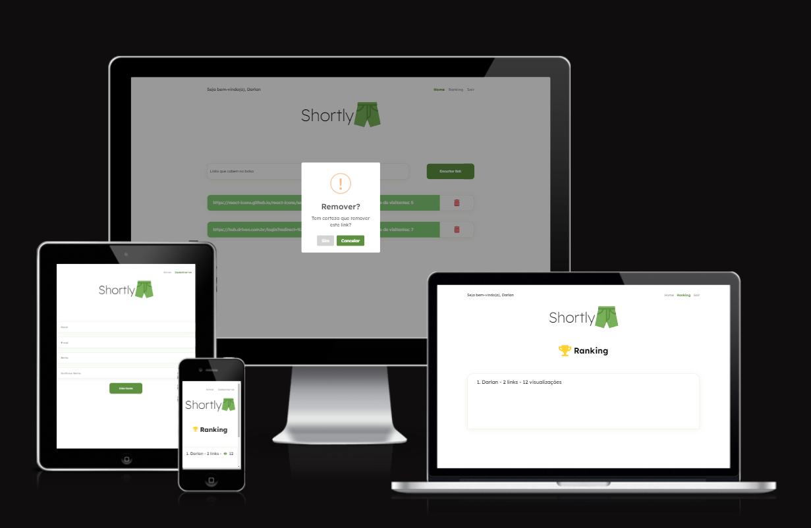

# Shortly

Shortly is a simple and efficient URL shortener application that allows users to create shortened versions of long URLs. This repository contains the source code for the Shortly application.

## Introduction
URL shorteners are handy tools that convert long and complex URLs into short and manageable links. The Shortly application provides a user-friendly interface to shorten URLs and share them easily with others. It can be deployed on your own server, allowing you to have full control over your shortened links.


## Features

- User registration and authentication
- Login persistence
- Create and delete links
- Ranking of most viewed links


## You can test the app at https://shortl-y.vercel.app/

[](https://shortl-y.vercel.app/)


### Using Shortly is straightforward:

1. Open the Shortly application in your web browser.
2. Register for an account or log in if you already have one.
3. On the home page, you'll find an input field to paste your long URL.
4. Click the "Shorten" button, and your shortened URL will be generated and displayed.
5. You can now share the shortened URL.

## Installation
To run Shortly on your local machine or server, follow these steps:

1. Clone this repository:
```bash 
git clone https://github.com/DarlanSchwartz/Shortly.git
```
2. Navigate to the project directory:
```bash 
cd Shortly
```
3. Install the required dependencies: npm install
```bash 
npm install
```
4. Run the server -> https://github.com/DarlanSchwartz/API-Shortly

5. Run this

```bash 
npm run dev
```

That's it! Shortly should now be up and running on your specified port. You can access the application through your web browser.
